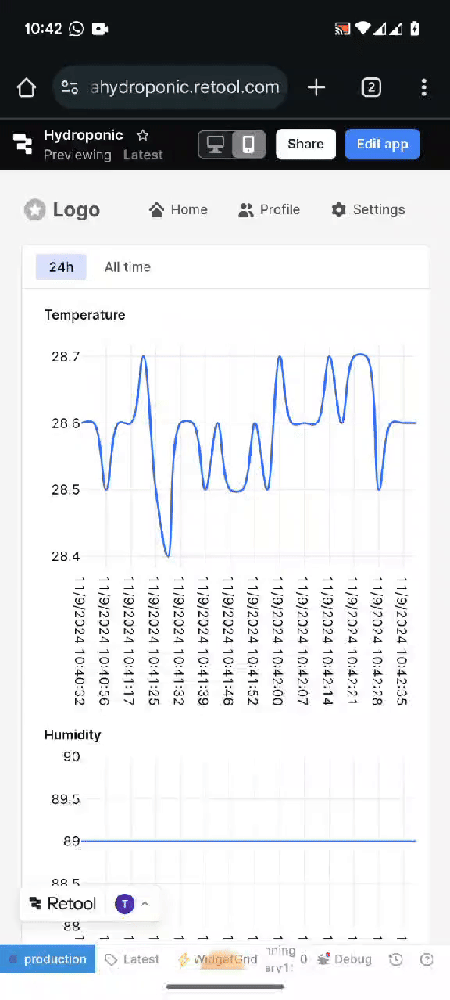

# Hydroponic System Monitoring with ESP32

- **Google Account**: thidaswin.athsara@gmail.com
- **Google Sheets URL**: https://docs.google.com/spreadsheets/d/19-jAPUh4LSR3_U1_81V-5ZSzh9QF_28df7PJhqAA5e0/edit?gid=0#gid=0
- **Google Apps Script Manage URL**: https://script.google.com/u/0/home/projects/1ywzhEQvpk2oj4yLe584IQHGVu3pJwMa_A1Xb6IvQ5rdXdV2BJyb40Xds/edit
- **Google Apps Script Webhook URL**: https://script.google.com/macros/s/AKfycbznfg1ZYowHA5rSPZ-oI8Yih8iY9VEZOEsImTSg4zSclewYjD9IenS9HVWyHduWUP1e/exec
  **Retool Web App Link**: https://athsarahydroponic.retool.com/apps/ab189782-9dcf-11ef-b23c-d39d35f88d50/Hydroponic
  **Important Note**: For safety and security, use an **alternative email account** when connecting Retool or other third-party apps to your Google Drive to avoid potential privacy issues. Ensure this account only contains the data necessary for this project.

## Project Overview

This project is designed to monitor environmental conditions in a hydroponic system using an ESP32 microcontroller. The system measures **temperature**, **humidity**, **light intensity**, and **water level** using a DHT11 sensor, LDR, and a water level sensor. The data is displayed on a TM1637 4-digit display, sent to a Google Sheet via Wi-Fi, and updated every 10 seconds.Retool is then used to create a web app that fetches this data at regular intervals (every 10 seconds) for real-time monitoring.

## Components Used

- **ESP32 DEVKIT V1** - Microcontroller with Wi-Fi capability.
- **DHT11 Temperature and Humidity Sensor** - Measures ambient temperature and humidity.
- **TM1637 4-Digit 7-Segment Display** - Displays temperature and humidity.
- **LDR (Light Dependent Resistor)** - Measures light intensity.
- **Water Level Sensor** - Monitors the water level.
- **Google Sheets** - Stores and logs environmental data.
- **Google Apps Script** - Receives data from the ESP32 and writes it to Google Sheets.
- **Retool**: Visualizes the data with interactive charts.

## Features

- **Real-time Monitoring**: Temperature, humidity, light intensity, and water level are monitored every 10 seconds.
- **Data Logging to Google Sheets**: The ESP32 sends sensor data to Google Sheets via a webhook created in Google Apps Script.
- **Display Data Locally**: The TM1637 display shows the temperature (°C) and humidity (%) in integer format.
- **Visualization in Retool**: The Retool web app fetches data from Google Sheets and displays it in real-time.
- **Direct integration with Retool**: Queries pull the latest data from Google Sheets for visualizing trends and changes over time.

## How to View Live Monitoring

- **PC Access**: Open the **Retool Web App Link** in any web browser on a PC.
- **Mobile Access**: Open the **Retool Web App Link** in a mobile browser for a responsive, live monitoring experience.

### Live Monitoring Preview

Below is a preview of how the live monitoring looks when accessed via mobile:



## Wiring and Setup

### ESP32 Pins Assignment

| Component                | ESP32 Pin |
| ------------------------ | --------- |
| **DHT11 (Data)**         | GPIO 5    |
| **TM1637 Display (CLK)** | GPIO 18   |
| **TM1637 Display (DIO)** | GPIO 19   |
| **LDR (Analog)**         | GPIO 34   |
| **Water Level Sensor**   | GPIO 36   |
| **VCC Connections**      | 3.3V      |
| **GND Connections**      | GND       |

### Wiring Instructions

1. **DHT11 Sensor**:

   - **Data Pin**: Connect to GPIO 5.
   - **VCC**: Connect to 3.3V.
   - **GND**: Connect to GND.

2. **TM1637 Display**:

   - **CLK**: Connect to GPIO 18.
   - **DIO**: Connect to GPIO 19.
   - **VCC**: Connect to 3.3V.
   - **GND**: Connect to GND.

3. **LDR Setup**:

   - Connect one side of the LDR to 3.3V.
   - Connect the other side of the LDR to GPIO 34.
   - Place a **10kΩ resistor** between GPIO 34 and GND to form a voltage divider

4. **Water Level Sensor**:
   - **Analog Output**: Connect to GPIO 36.
   - **VCC**: Connect to 3.3V.
   - **GND**: Connect to GND.

## Software Setup

### Step 1: Program the ESP32

1. **Install Libraries**:

   - In Arduino IDE, go to **Library Manager** and install the following:
     - `DHT sensor library` by Adafruit.
     - `TM1637Display` library for controlling the TM1637.

2. **Code for ESP32**

   Upload the following code to the ESP32:

   ```cpp
   #include <WiFi.h>
   #include <HTTPClient.h>
   #include <DHT.h>
   #include <TM1637Display.h>

   const char* ssid = "YOUR_SSID";
   const char* password = "YOUR_PASSWORD";
   const char* webhookURL = "YOUR_GOOGLE_SHEETS_WEBHOOK_URL";

   #define DHTPIN 5
   #define DHTTYPE DHT11
   DHT dht(DHTPIN, DHTTYPE);
   #define CLK 18
   #define DIO 19
   TM1637Display display(CLK, DIO);
   #define LDR_PIN 34
   #define R_FIXED 10000
   #define WATER_LEVEL_PIN 36

   void setup() {
     Serial.begin(115200);
     WiFi.begin(ssid, password);
     while (WiFi.status() != WL_CONNECTED) {
       delay(1000);
       Serial.println("Connecting to WiFi...");
     }
     dht.begin();
     display.setBrightness(0x0f);
     Serial.println("Starting sensor tests...");
   }

   void loop() {
     float h = dht.readHumidity();
     float t = dht.readTemperature();
     int lightIntensityRaw = analogRead(LDR_PIN);
     int waterLevelRaw = analogRead(WATER_LEVEL_PIN);

     float ldrResistance = (float)R_FIXED * (1023.0 / lightIntensityRaw - 1);
     float lux = 500 / (ldrResistance / 1000);

     if (isnan(h) || isnan(t)) {
       Serial.println("Failed to read from DHT sensor!");
       display.showNumberDecEx(0b1111, 0b01000000);
     } else {
       Serial.print("Temperature: ");
       Serial.print(t, 1);
       Serial.print(" °C, Humidity: ");
       Serial.print(h, 1);
       Serial.print(" %, Light Intensity: ");
       Serial.print(lux);
       Serial.print(" lux, Water Level: ");
       Serial.println(waterLevelRaw);

       displayTemperatureAndHumidity(round(t), round(h));

       if (WiFi.status() == WL_CONNECTED) {
         HTTPClient http;
         http.begin(webhookURL);
         http.addHeader("Content-Type", "application/json");

         String jsonData = "{\"temperature\":" + String(t, 1) +
                           ", \"humidity\":" + String(h, 1) +
                           ", \"light\":" + String(lux) +
                           ", \"water\":" + String(waterLevelRaw) + "}";

         int httpResponseCode = http.POST(jsonData);
         if (httpResponseCode > 0) {
           Serial.println("Data sent successfully");
         } else {
           Serial.print("Error sending data: ");
           Serial.println(httpResponseCode);
         }
         http.end();
       }
     }
     delay(10000);
   }

   void displayTemperatureAndHumidity(int temp, int humidity) {
     int displayValue = (temp * 100) + humidity;
     display.showNumberDecEx(displayValue, 0b11100000, true);
   }
   ```

### Step 2: Prepare the Google Sheet and Apps Script

1. **Create a new Google Sheet**:

   - Name the sheet and create columns labeled: `Timestamp`, `Temperature`, `Humidity`, `Light Intensity`, `Water Level`.

2. **Create Google Apps Script**:

   - Go to **Extensions > Apps Script** in Google Sheets.
   - Paste the following script:

     ```javascript
     function doPost(e) {
       const sheet = SpreadsheetApp.getActiveSpreadsheet().getActiveSheet();
       const data = JSON.parse(e.postData.contents);
       sheet.appendRow([
         new Date(),
         data.temperature,
         data.humidity,
         data.light,
         data.water,
       ]);
       return ContentService.createTextOutput("Data added successfully");
     }
     ```

   - **Deploy as a Web App**:
     - Go to **Deploy > Manage deployments**, create a new deployment as a **Web App**.
     - Set access to **Anyone with the link** and copy the URL. This is your webhook URL.

3. **Add Webhook URL to ESP32 Code**:

   - Paste the URL into the ESP32 code as `webhookURL`.

   ### Step 3: Setting Up the Retool Web App

4. **Create a Retool account** and use an **alternative email** dedicated to this project for added security.
5. **Connect to Google Sheets**:
   - Add a new resource in Retool by selecting **Google Sheets** and connecting it to the spreadsheet you created.
6. **Create a Query in Retool**:
   - Set up a query called `fetchSheetData` to pull data from your Google Sheets.
   - Configure the query to **refresh every 10 seconds** to fetch new data as it is updated by the ESP32.
7. **Build the Web App**:
   - Add a **Table** or **Chart** component to the Retool canvas.
   - Use the data from `fetchSheetData` to populate the chart for real-time visualization.
   - Configure the chart's **Data (JS)** field to map the `Timestamp` as the x-axis and `Temperature`, `Humidity`, etc., as the y-axes.

### Detailed Retool Integration Steps

- **Real-Time Data**: To make the data real-time, the `fetchSheetData` query is set to run at an interval of 10 seconds.
- **Visualization Components**:
  - The **Chart component** displays a real-time line graph of temperature versus time.
  - Customize the chart using JavaScript within Retool to handle data parsing and rendering.

### Final Setup

- **Test the ESP32** by monitoring the Serial Monitor to ensure data is being sent correctly.
- **Verify data in Google Sheets** to ensure it is updated every 10 seconds.
- **Open the Retool web app link** to view the real-time chart and table updating with new data.

## Security Notes

- **Use an Alternative Email**: For connecting third-party services like Retool to Google Drive, use a dedicated email that only contains project-specific data.
- **Review Permissions**: Regularly check and manage permissions for external apps in your Google Account at [Google Account Permissions](https://myaccount.google.com/permissions).
